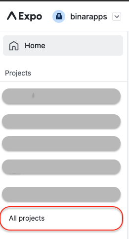
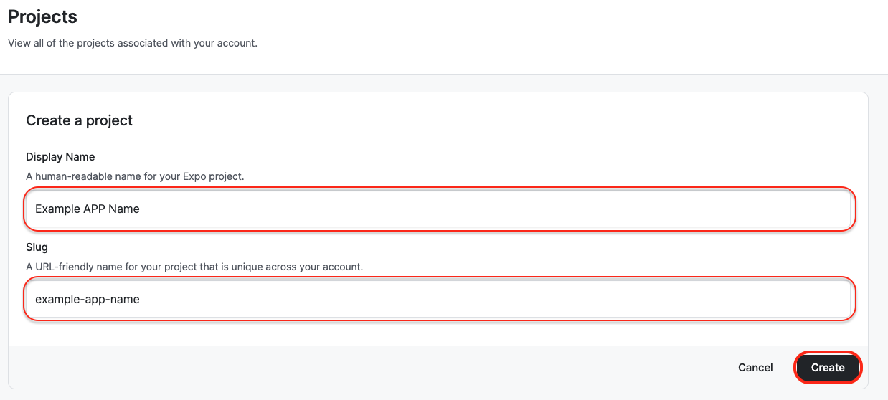

import Details from '@site/src/components/Details'

# QUICK START

:::warning
If this is not your first time using BACA we are strongly recommend going through [bootstrap docs](/docs/bootstrap/create-new-app).
:::

## **What you need to do, to start development**

---

### Step 1. Setup repository

```bash
git clone git@github.com:binarapps/baca-react-native-template.git name_of_your_app
cd name_of_your_app
```

---

### Step 2. Login / register to expo

> Skip this step if you are already logged in

Login to expo account on your local machine.

```bash
eas login

## veify if you are correctly logged

eas whoami
```

---

### Step 3. Create project on expo.dev

1. Sign in to the expo dev console (account created in the first step of repo configuration).

2. Select the proper organization you are working for from a dropdown:

   

   Ideally, it will be an organization created by the client (especially for production builds), to easily pass access after the end of development.

3. Create a new Project in the organization.

   - From the sidebar menu click **All projects** button:

     

   - On the page with the list of projects click **+New Project** button:

     

   - Apply **display name** and **slug** of your project.

     Display name is a name that will be visible in the Expo Dev Console.

     Slug is the name that will link your Expo application with your code.

     

---

### Step 4.Sync project with code.

Please gather this data:

1. **app name** - you can add **display name** from previous step, or add anything you want here, this name will be displayed for users later
2. **slug name** - created in 1-st point.
3. **owner** - organization picked from the list in 1-st point

:::note

If you will have issues with finding this values, please check [bootstrap testing docs](/docs/bootstrap/testing)

:::

If you gather all this data please run this command:

```bash
yarn baca bootstrap --simple
```

:::warning
Please verify all changes made with the script
:::

---

### Step 5. Make environment variables setup - [tutorial](/docs/doppler-config)

---

## Next steps:

Congrats, if you have completed all of this 5 steps, you can start development, after first iteration of development you can:

1. [Prepare app for testing](/docs/bootstrap/testing)
2. [Deploy your app](/docs/deploy/intro)
   1. [iOS](/docs/deploy/ios)
   2. [android](/docs/deploy/android)
