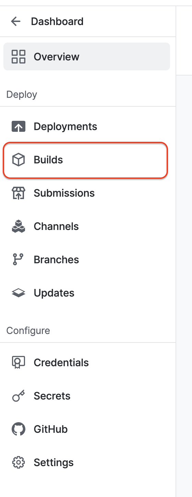
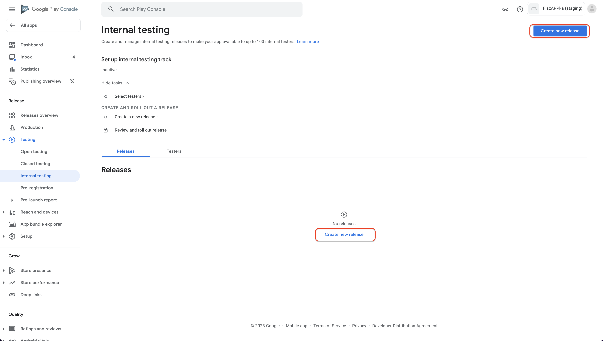
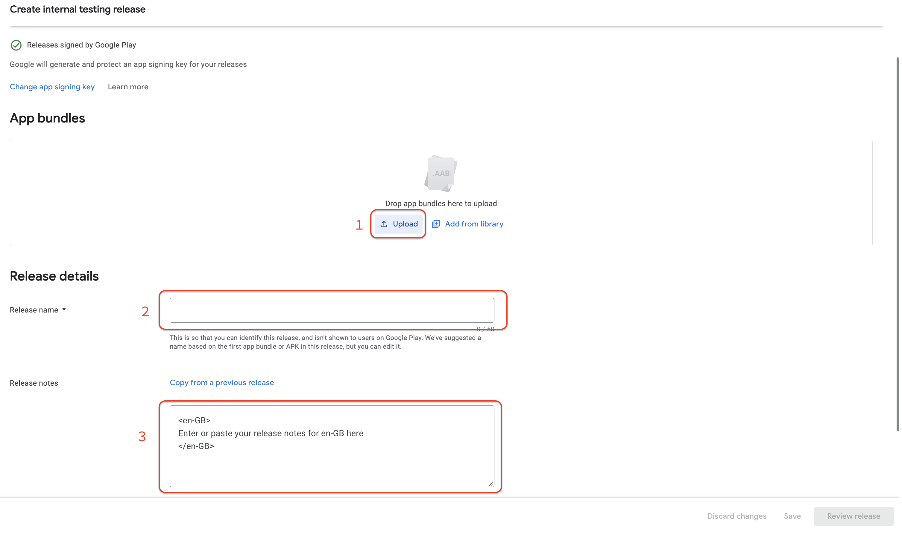
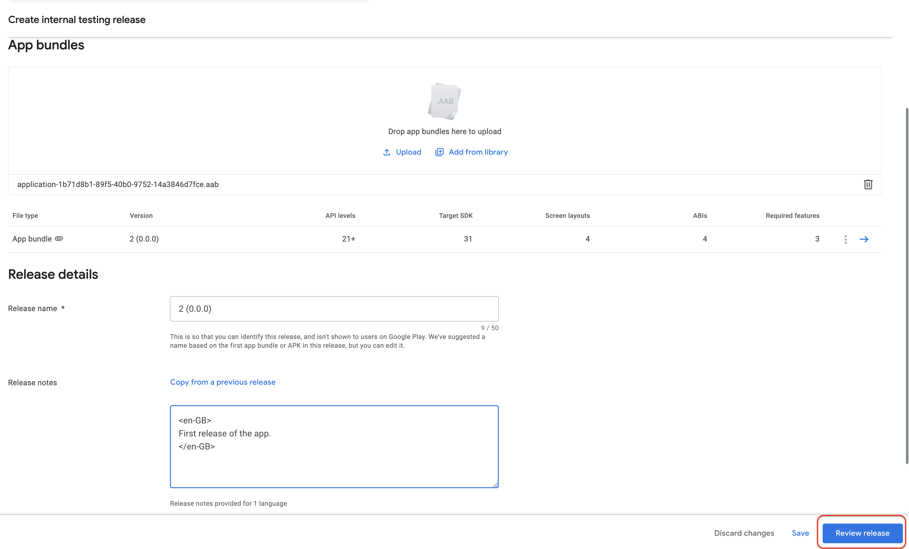
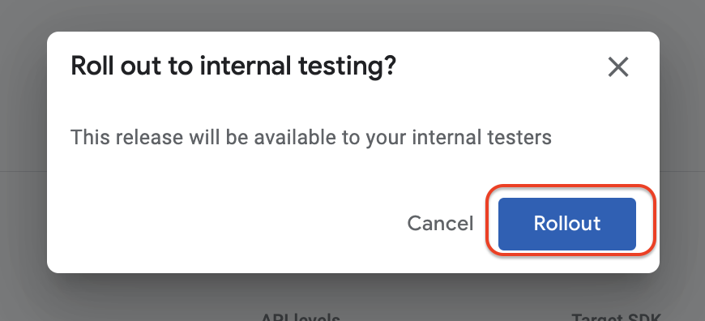
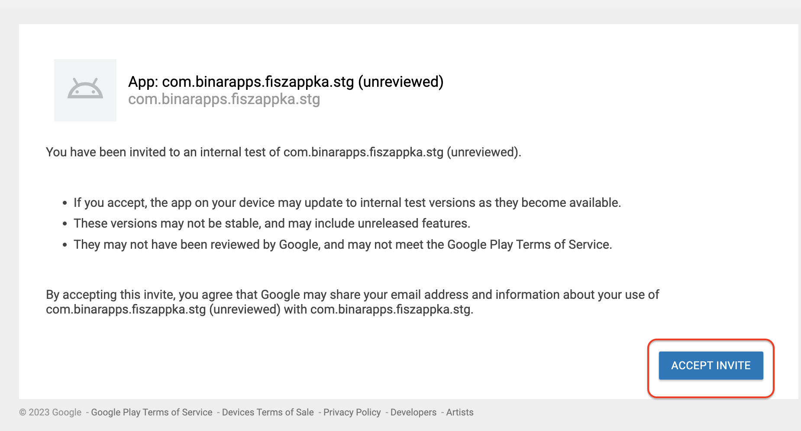

# Build & deploy the Android app

---

## Build first Android binary 🕐 / 📱

<ol>
<li>
Select the proper build type

You need to decide if you want to build an app that will be shared with Google Play Store or if it will be sent directly to final users.

If it will be deployed to the store you should build an <b>app-bundle</b> (.aab) file otherwise an <b>apk</b> (.apk) file.

Configure buildType in eas.json as follows:

```json
{
  // ...
  "build": {
    "production": {
      "android": {
        // success-line
        "buildType": "app-bundle" // you can choose here between apk and app-bundle
        // ...
      }
    },
    "staging": {
      "android": {
        // success-line
        "buildType": "app-bundle" // you can choose here between apk and app-bundle
        // ...
      }
    },
    "qa": {
      "android": {
        // success-line
        "buildType": "apk" // you can choose here between apk and app-bundle
        // ...
      }
    }
  }
}
```

</li>
<li>
In the terminal run the build command (choose the proper environment (qa/staging/production)

```bash
yarn build:[qa/staging/production]:android
```

</li>
<li>
⚠️ You will be asked to generate a new Android Keystore. ⚠️

If your app already exists (perhaps the app has already been deployed to the store) and you have the Keystore file press <b>n</b> and follow the steps.

If you do not have the Keystore file yet press <b>y</b>.

CONGRATULATION !! 🥳🥳 You just started the first Android build of your app!

</li>
</ol>

---

## Deploy the first version of the Android app for tests in Google Play Store. (internal testing) 🕐 / 📱

The first submission to Google Play Store needs to be done manually.

### Step 1 - Log in to Play Developer Console.

[Play developer console link](https://play.google.com/console/u/0)

### Step 2 - Choose your developer account (if you have more than one):


### Step 3 - Create new app

<ol>
<li>
Press Create App button on the right


</li>
<li>
Fill out the form for creating about new App.


Fields description:

1. Add your app name. Depending on the type of your app, you are creating:

   - your app name (qa)

   - your app name (staging)

   - your app name

2. Choose your primary language (English, Polish, or some other).

3. Confirm Developer Programme Polices and US export laws

</li>
<li>
Press Create app button in the right bottom corner (picture in the previous step).

You should create a new app for each environment you need to use (e.g. qa, staging, production).

</li>
</ol>

### Step 4 - Download your build file (<b>apk</b> or <b>app-bundle</b>) from the expo dev console.

<ol>
<li>Log in to the expo dev console.</li>
<li>Choose your organization from the dropdown in the top left corner.</li>
<li>Choose your project from the left sidebar.</li>
<li>
Choose Builds tab from the left sidebar.



</li>
<li>
Pick a build you want to release for testing


Sometimes if you do not see the build which you want to download, you may need to refresh the page (there is some heavy caching on the Expo site).

</li>
<li>
Download the build binary file.


If you downloaded an <b>apk</b> file, you can share this file directly with your end users (could be sent via slack, diawi, google drive, etc.).

If you downloaded an <b>app-bundle</b> file, it will be used in the next step.

</li>
</ol>

### Step 5 - Prepare the internal test.

<ol>
<li>
Go to the Internal testing tab from the menu on the left (ensure you are working on the proper app - the app name is visible in the right top corner)


</li>
<li>
Press Create new release button.



</li>
<li>
Upload the binary file (downloaded in the previous step <b>app-bundle</b> file - .aab) and fill out the release form.



Fields description:

1)Button to upload binary file (upload binary download in the previous step (7.d).

2)Release name - will be automatically filled based on your build number and app version. You could change it to any other name.

3)Release notes - notes visible for users in the Play Store talking about changes in the current version of the app.

</li>
<li>
Press Review release button



</li>
<li>
Rollout new release

If your app does not have any issues (there will be shown no errors) it means that is ready to go public.

Press Start roll-out internal testing button


If you meet any errors, you need to resolve them before releasing an app for internal testing.

</li>
<li>
Confirm roll-out operation modal

Press the Rollout button.



CONGRATULATION !! 🥳🥳 You just released the first version of the app for internal testing.

</li>
</ol>

### Step 6 - Invite testers to test your app.

<ol>
<li>Go to the internal testing tab (7.e.i)</li>
<li>
Enter Testers tab


</li>
<li>
Add testers.

You can add testers in two different ways.


1)Select an already define (if you have such) list of testers for example Binarapps

2)Create a new list of testers. You will need to add names and testers' emails to the list.

To apply any changes press Save changes button in the bottom right corner.

</li>
<li>
Send invitation link to testers.

1.Press Copy link button


2.Send copied link to testers.

Testers should enter the link in web browser (ideally on a mobile device) when they are logged in to the email address provided on the testers list. Otherwise, the link could be opened in incognito mode - login is required to the proper Google Account.

3.Testers should accept invitation by pressing Accept invite button.



4.Testers are now able to download an app from Google Play Store - press the button download it on Google Play.

The link needs to be opened on an Android device, otherwise, the installation will not be possible.


CONGRATULATION !! 🥳🥳 You just invited the first tester of the app for internal testing.

</li>
</ol>

---

## Build and deploy the next versions of the app to the Google Play Store. 🌈 / 🕐 / 📱

To run this step, ensure that you already have built and deployed the first version of the app (it means, that you need to go through steps 6 and 7 for qa / staging / production version of the app depending of your needs)

Only the first submission of the Android app needs to be done manually. Every next submission could be automated 🥳.

To make it possible, <b>Google Service Account</b> key file needs to be provided.

<ol>
<li>
Generate <b>Google Service Account</b> key → follow the instruction.

To generate the above you will need to contact with account owner of your project.

</li>
<li>
Put generated <b>Google Service Account</b> key in the root dir of your project.
</li>
<li>
Add Google Service Account key to .gitignore file.

```
your_google_service_account_key.json
```

</li>
<li>
Configure eas.json to use the <b>Google Account Service</b> key, and to send a new app version for the internal testing path.

```json
"submit": {
    "production": {
      "android": {
        // success-line
        "serviceAccountKeyPath": "path_to_your_google_service_account_key",
        "track":"internal"
      }
    },
    "staging": {
      "android": {
        // success-line
        "serviceAccountKeyPath": "path_to_your_google_service_account_key",
        "track":"internal"
      }
    },
    "qa": {
      "android": {
        // success-line
        "serviceAccountKeyPath": "path_to_your_google_service_account_key",
        "track":"internal"
      }
    }
}
```

</li>
<li>
Build and deploy a new version of the app

In project dir terminal run:

```bash
yarn deploy:[qa/staging/production]:android
```

Choose the proper app version depending on the environment for which you want to create a build.

CONGRATULATION !! 🥳🥳 You have just automated the build and deployment process for Android!

</li>
</ol>
