# Doppler configuration 🌈

Thanks to doppler you will be able to autoamtically mange your environment varialbes.

<details>
    <summary>1.Sign up for the Doppler tool</summary>
a. Ideally, the account will be created by the client, the developer will be invited to participate in a workspace
</details>
**
<details>
    <summary>2.Create a new workspace for the project.</summary>
a. Open a dropdown of the workspaces list:


b. Click <b>+Create workspace</b> button:


c. Fill in the workspace name:


d. Confirm <b>Create Workspace →</b> button


</details>
**
<details>
    <summary>3.Create new project</summary>
a. In newly created workspace please click <b>Create Project</b> button


b. Provide project name


c. Confirm with <b>Create Project →</b> button


</details>
**
<details>
    <summary>4.Adding environment variables.</summary>
a. Enter the projects tab, and select a newly created project

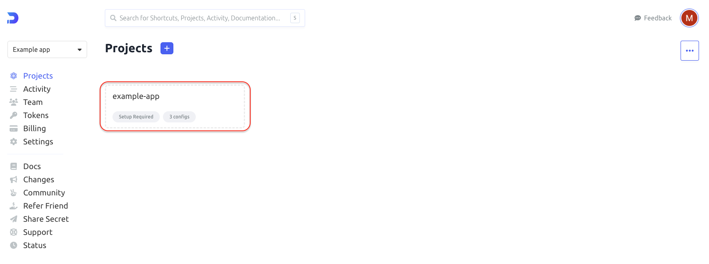

b. Each project consist of three predefined environments - dev, stg and prd. \*\*
Click each of them to enter environment variable page.
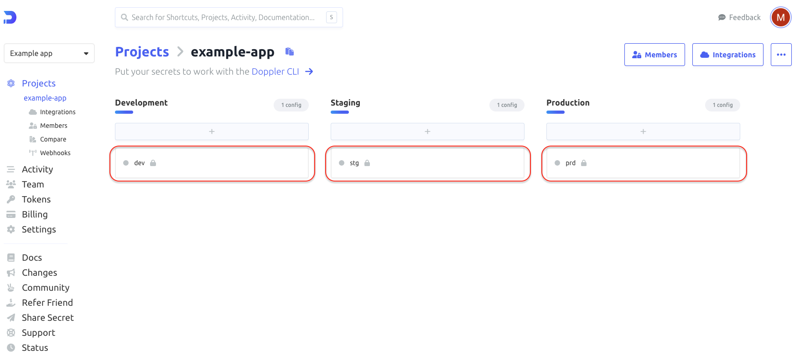

c. To add a new environment variable click on <b>Add first secret</b>
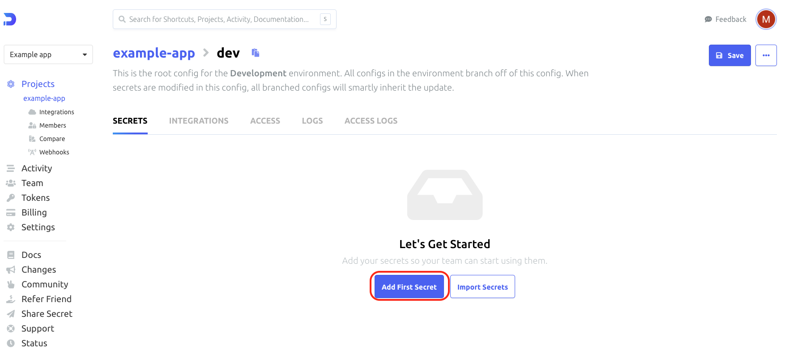

d. Enter the name of the environment variable name and its value into proper inputs: \*\*
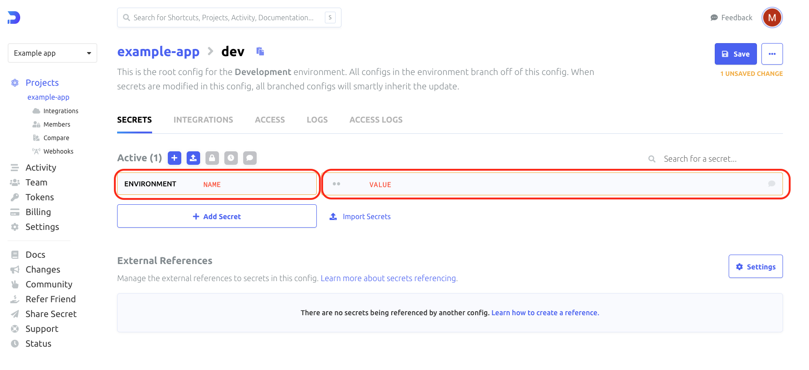

You can add more environment variables by clicking <b>+ Add Secret</b> button, and providing names and values.
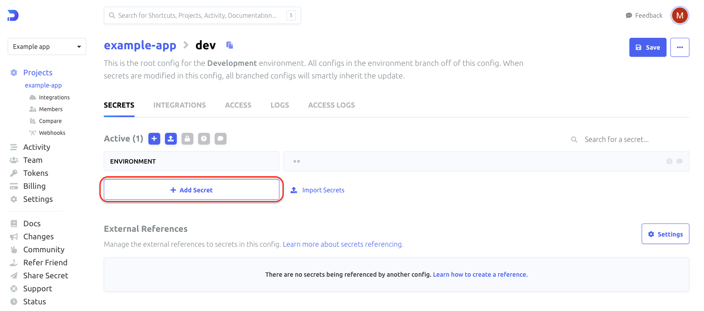

e. Confirm with <b>Save</b> button:
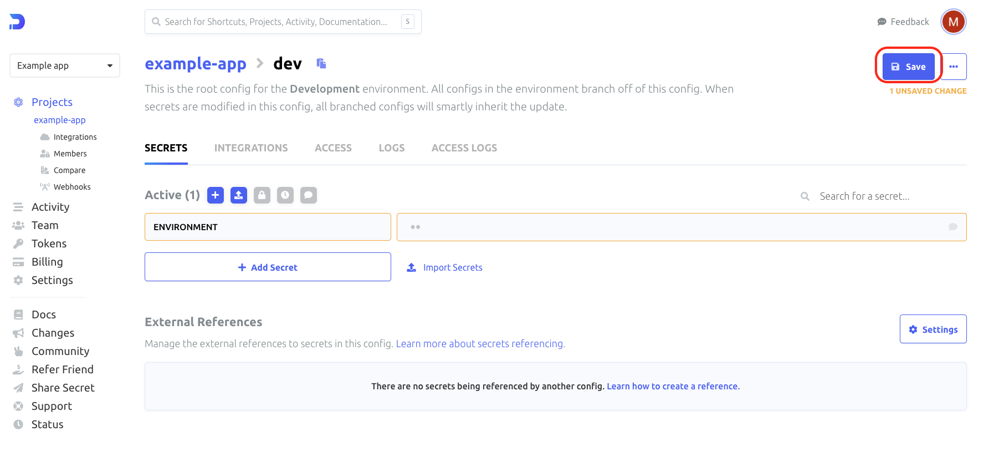

g. Make sure that you have consistent data in each environment. In these step, you can copy newly created variable to the rest environments (select checkboxes). When selected the necessary environments confirm with <b>Save</b> button:
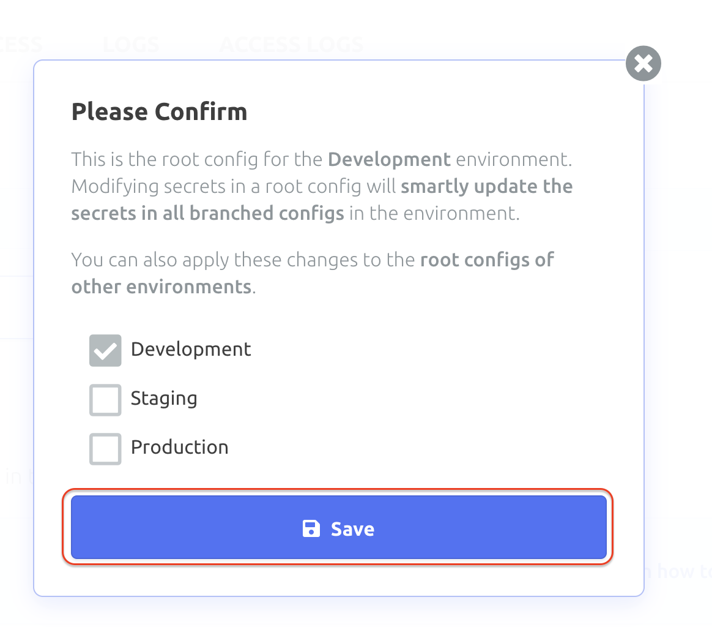

</details>
**
<details>
    <summary>5.Implement Doppler tool onto the app.</summary>

Use gist to go through the implementation of Doppler tool in the app. \*\*
In doppler_variables.sh file, please use generated Access Tokens from the above.

</details>
**
<details>
    <summary>6.Get Access from your code level</summary>

a. Enter <b>Access</b> tab:

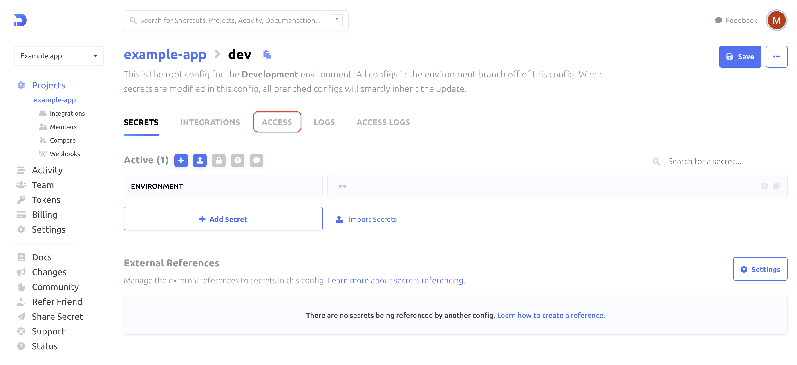

b. In the Access tab you should click on <b>+Generate</b> or <b>Generate Service Token</b> button:
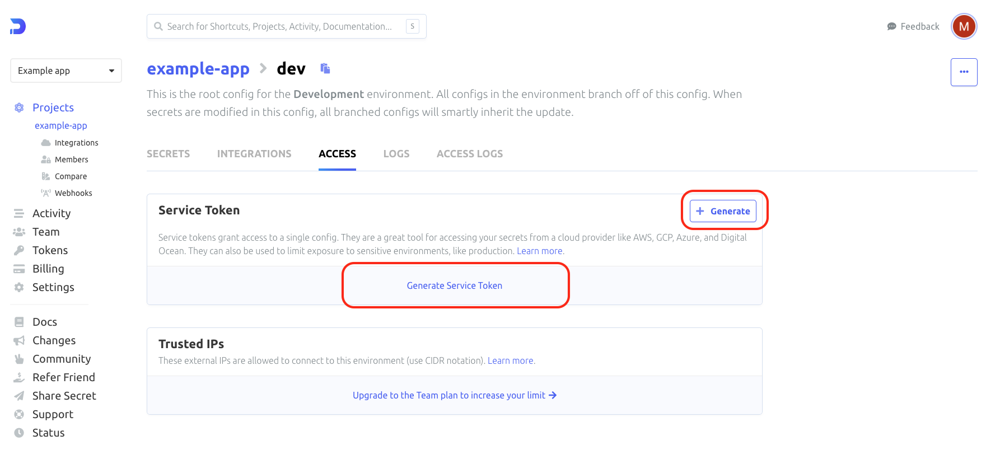

c. Provide some unique name to your personal access token:
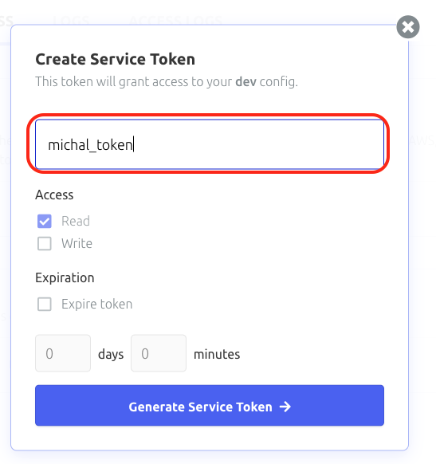

d. And next click <b>Generate Service Token→</b> button:


e. Copy your Access Token (Service Token).

Save your Access Token, it will be used later to grant access from the code level.
If you do not copy the token, you will need to revoke that token and generate a new one.

Click <b>copy</b> button:
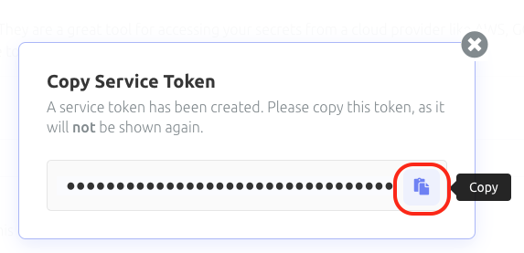

f. To be able to use environment variables for different environments (qa/staging/production) you need to generate an access token for every environment.

</details>
**
<details>
    <summary>7.Check if everything works correctly.</summary>

In project dir terminal run:

```bash
yarn prepare:(qa/staging/production)
```

Choose the proper app version depending on the environment for which you want to generate env file.

<b>.env</b> file should be generated and consist of variables passed to Doppler, and some extra doppler variables as DOPPLER_CONFIG.

CONGRATULATION !! 🥳🥳 You have configured the Doppler tool for your project!

</details>
