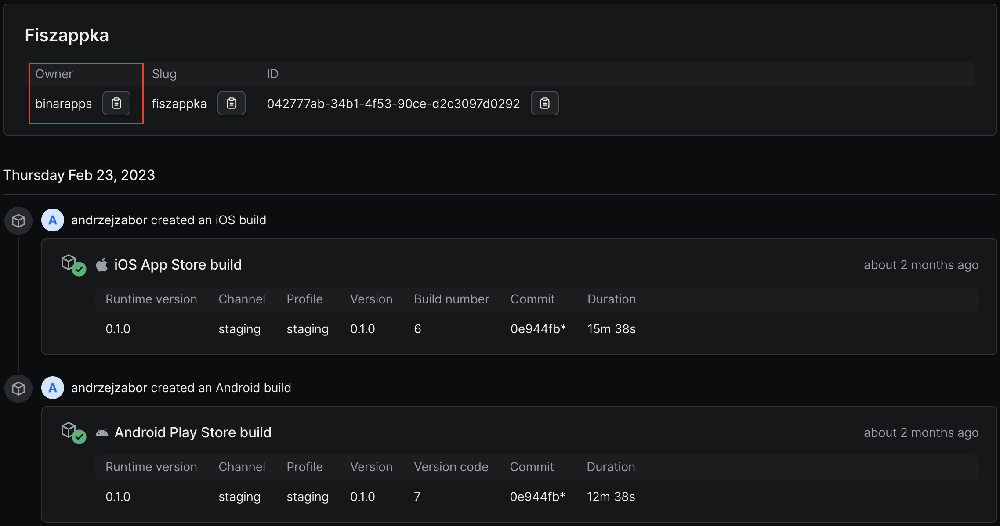
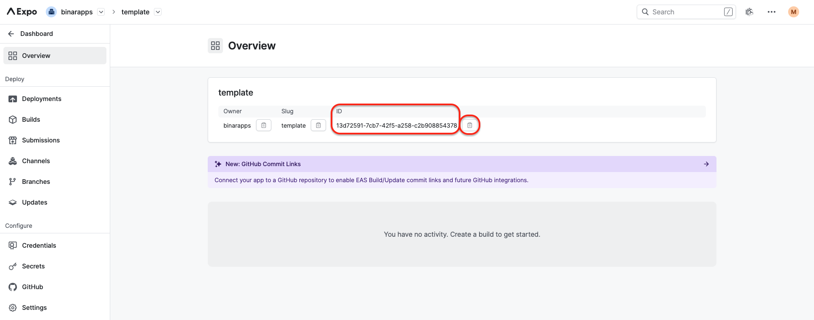

# Bootstrap - testing

After this step you will be ready to publish your app for testers, but first we need to make some steps to make everything working :)

## **What you need to prepare for testing?**

<details>
  <summary>1. App name</summary>
  
  You need prepare some catchy name for you app, if not provided by client
</details>

<details>
  <summary>2. App slug</summary>
  
  
  
  You can find it in expo console
</details>

<details>
  <summary>3. Organziation owner (default to binarapps)</summary>



You can find it in expo console

</details>

<details>
  <summary>4. Eas project id</summary>
  
  
  
  You can find it in expo console
</details>

<details>
  <summary>5. Provide necessary assets for your application (app icons and splash screen).</summary>
  
  [Expo recommendations about app icons and splash screen.](https://www.figma.com/file/gDLi6LNtNq50FycJ30t7rw/Expo-App-Icon-%26-Splash-(Community)?node-id=1-1357&t=VbJUpoye07JAuVLv-0)

App icons for Android and iOS devices need to follow different requirements - all necessary requirements can be found here.
Config inside the app is prepared that your icons will be named respectively:

- for Android:
  - prepare background color
  - adaptive-icon-qa.png
  - adaptive-icon-staging.png
  - adaptive-icon-production.png
- for iOS:
  - icon-qa.png
  - icon-staging.png
  - icon-production.png
- for web:
  - favicon-qa.png
  - favicon-staging.png
  - favicon-production.png
- splash screen:
  - splash.png

And placed in proper folders:

- for android: `assets/icons/android`
- for ios: `assets/icons/ios`
- for web: `assets/icons/web`
- splash screen: `assets`

For the Android adaptive icon, you should also provide proper background color as it needs to be uploaded with transparent background. You will be prompted to pass this value.

You can also change it later in `app.config.ts` file as follows:

```js
// CONFIG: Add your android adaptive icon background color here
adaptiveIconBackgroundColor: {
  production: 'bg_color_production',
  staging: 'bg_color_staging',
  qa: 'bg_color_qa',
},
```

</details>

<details>
  <summary>6. App identifiers</summary>
  
Your application should have unique identifiers of your app (they will be used in stores), they are respectively: 
  - for Android - app package name
  - for iOS - bundle identifier

They could have the same value for android and iOS, and normally they have a structure like this:
`com.your_company_name.your_project_name`

If you have some domain, for example: example.com, your bundle id could be: `com.example`

</details>

<details>
  <summary>7. URL scheme</summary>
  
URL scheme link into your app. For example, if we set this to 'demo', then `demo://` URLs would open your app when tapped.
It is only available in standalone apps.
</details>

<details>
  <summary>You should have data like this:</summary>
  
You can generate this data and save it in some notepad or somewhere else.
```json
{
  "androidPackageName": "your_android_package_name",
  "iosBundleIdentifier": "your.ios.bundle.identifier",
  "appName": "Your name",
  "owner": "expo_owner_name",
  "slug": "expo_app_slug",
  "easProjectId": "xxx-xxx-xxx-xx",
  "scheme": "yourUrlScheme",
  "adaptiveIconBackgroundColor": "#2E7AF0CC"
}
```
</details>

<hr>

## Bootstraping project

### **After you will collect all necessary data run this command:**

```sh
yarn bootstrap:new_app
```

## Potential issues

- gitignore
  - It's possible that gitgnore will not hide correct files, if that's the case please check template repo and copy `.gitignore` file
